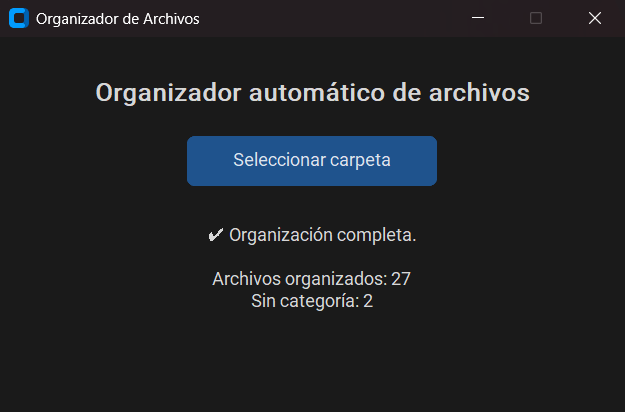

# 📁 Organizador Automático de Archivos

Organizador de archivos hecho en Python que clasifica y mueve automáticamente los archivos de una carpeta en subcarpetas según su tipo (imágenes, documentos, música, etc.).

Incluye:
- ✅ Interfaz gráfica moderna con [CustomTkinter](https://github.com/TomSchimansky/CustomTkinter)
- ✅ Uso desde línea de comandos (CLI)
- ✅ Script para generar una carpeta de prueba con archivos de todo tipo (¡incluso en subcarpetas!)
- ✅ Empaquetable como `.exe` para usar sin Python

---



---

## 🧪 Generar archivos de prueba

Podés usar el script `prueba.py` para crear automáticamente una carpeta llamada `carpeta_de_prueba` que contiene archivos con extensiones variadas (imágenes, música, documentos, etc.), incluso organizados en subcarpetas como:

```
carpeta_de_prueba/
│
├── a.jpg
├── a.pdf
├── a.zip
│
├── subcarpeta_1/
│   └── a.docx
├── subcarpeta_2/
│   └── a.mp3
```

Esto te permite probar el funcionamiento real del organizador.

---

## 📦 Instalación

1. Cloná el repositorio:
```bash
git clone https://github.com/TomyGauna/Organizador-Automatico-de-Archivos.git
cd Organizador-Automatico-de-Archivos
```

2. Creá y activá un entorno virtual (no es necesario, pero lo recomiendo):
```bash
python -m venv venv
venv\Scripts\activate  # En Windows
# o
source venv/bin/activate  # En Linux/macOS
```

3. Instalá las dependencias:
```bash
pip install -r requirements.txt
```

---

## 🚀 Uso

### 🖥️ GUI (modo gráfico)
```bash
python organizador.py
```

Esto abre una ventana donde podés seleccionar la carpeta a organizar.

### 💻 CLI (modo consola)
```bash
python organizador.py --modo cli --carpeta "ruta/a/tu/carpeta"
```

También podés dejar que el script te pregunte:
```bash
python organizador.py --modo cli
```

Incluso si solo pasás `--carpeta`, entra en modo CLI automáticamente.

---

## 🧠 ¿Cómo funciona?

1. Detecta todos los archivos en la carpeta seleccionada.
2. Clasifica cada archivo por su extensión en categorías como:
   - Imágenes: `.jpg`, `.png`, etc.
   - Documentos: `.pdf`, `.docx`, `.txt`, etc.
   - Música, Videos, Comprimidos, Instaladores, etc.
3. Crea subcarpetas automáticamente y mueve los archivos allí.
4. Si no reconoce una extensión, los guarda en la carpeta `Otros`.
5. Si ya existe un archivo con el mismo nombre, crea una copia (`_copia1`, `_copia2`, etc.).

---

## 📦 Exportar como `.exe`

Ya hay un `.exe` del código base creado, pero si queres modificar algo (agregar más extensiones, optimizarlo, etc.) podes hacerlo de la siguiente manera:

Crea un ejecutable con `pyinstaller`:

```bash
pip install pyinstaller
pyinstaller --noconsole --onefile organizador.py
```

Esto te genera un `.exe` dentro de la carpeta `dist/` listo para usar.

---

## 💬 Autor

Desarrollado por Tomás Gauna como parte del desafio "20 Proyectos en 30 Dias".  
Este desafio fue pensado para practicar Python de forma creativa y mostrarlo profesionalmente en redes.

---